# LunaMars

API em ASP.NET Core Web API para simular o monitoramento de uma colonia humana na Lua ou em Marte.

O sistema registra colonias, setores, sensores ambientais, leituras, recursos vitais, alertas e missoes de resposta. O principal fluxo da API acontece quando uma leitura de sensor e registrada: a aplicacao valida os dados, calcula o nivel de risco e gera um alerta automaticamente quando o risco for alto ou critico.

## Integrantes

- Pedro Oliveira - 99943
- Diego Cabral - 557817
- Débora Ivanowski - 555694

## Tema espacial

Colonias fora da Terra precisam controlar oxigenio, pressao, temperatura, radiacao, energia e recursos vitais. Uma falha nesses pontos pode colocar toda a base em risco.

O projeto se conecta ao tema espacial porque simula uma API usada para apoiar a operacao de habitats na Lua ou em Marte.

## Conexao com ODS

- ODS 9: Industria, inovacao e infraestrutura.
- ODS 11: Cidades e comunidades sustentaveis.
- ODS 13: Acao contra a mudanca global do clima.

## Tecnologias

- C#
- .NET 8
- ASP.NET Core Web API
- Entity Framework Core
- Oracle Database
- Swagger

## Estrutura

```text
LunaMars.API
|-- Controllers
|-- Data
|-- Enums
|-- Exceptions
|-- Interfaces
|-- Migrations
|-- Models
|-- Services
|-- Program.cs
`-- appsettings.json
```

## Requisitos atendidos

- POO com entidades do dominio espacial.
- Heranca com `EquipamentoEspacial`, `RoverExploracao` e `SateliteOrbital`.
- Classe abstrata em `EquipamentoEspacial`.
- Interfaces em `ICalculadoraRisco` e `IAlertaService`.
- Uso de `DateTime` em leituras, alertas, missoes, recursos e equipamentos.
- Excecoes especificas para leituras invalidas, dados invalidos, setor, sensor, alerta, recurso, missao e equipamento.
- Conexao com Oracle Database via `UseOracle`.

## Configurando o banco Oracle

O projeto usa Oracle Database com Entity Framework Core.

O arquivo `LunaMars.API/appsettings.json` fica no GitHub apenas com valores de exemplo:

```json
{
  "ConnectionStrings": {
    "OracleConnection": "User Id=SEU_USUARIO;Password=SUA_SENHA;Data Source=oracle.fiap.com.br:1521/ORCL;"
  }
}
```

Para rodar localmente sem subir senha no GitHub, crie um arquivo chamado:

```text
LunaMars.API/appsettings.Local.json
```

Coloque nele os seus dados reais do Oracle:

```json
{
  "ConnectionStrings": {
    "OracleConnection": "User Id=rm00000;Password=sua_senha;Data Source=oracle.fiap.com.br:1521/ORCL;"
  }
}
```

O arquivo `appsettings.Local.json` esta no `.gitignore`, entao ele deve ficar apenas no seu computador.

## Como executar

Entre na pasta da API:

```bash
cd LunaMars.API
```

Restaure os pacotes:

```bash
dotnet restore
```

Compile o projeto:

```bash
dotnet build
```

Crie ou atualize as tabelas no Oracle:

```bash
dotnet ef database update
```

Execute a API:

```bash
dotnet run
```

Acesse o Swagger:

```text
http://localhost:5185/swagger
```

Se o terminal mostrar outra porta, use a porta exibida pelo `dotnet run`.

## Principais endpoints

```text
GET  /api/colonias
POST /api/colonias
DELETE /api/colonias/{id}

GET  /api/setores
POST /api/setores
GET  /api/setores/colonia/{coloniaId}
DELETE /api/setores/{id}

GET  /api/sensores
POST /api/sensores
GET  /api/sensores/setor/{setorId}
DELETE /api/sensores/{id}

GET  /api/leituras
POST /api/leituras
GET  /api/leituras/setor/{setorId}
DELETE /api/leituras/{id}

GET  /api/alertas
GET  /api/alertas/abertos
PUT  /api/alertas/{id}/finalizar
DELETE /api/alertas/{id}

GET  /api/recursos
GET  /api/recursos/criticos
POST /api/recursos
DELETE /api/recursos/{id}

GET  /api/missoes
POST /api/missoes
PUT  /api/missoes/{id}/concluir
DELETE /api/missoes/{id}

GET  /api/equipamentos/rovers
POST /api/equipamentos/rovers
DELETE /api/equipamentos/rovers/{id}
GET  /api/equipamentos/satelites
POST /api/equipamentos/satelites
DELETE /api/equipamentos/satelites/{id}
```

## Fluxo principal

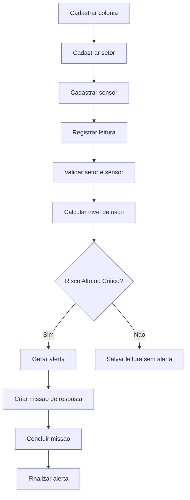

## Exemplo do POST /api/leituras

```json
{
  "valor": 15.2,
  "unidadeMedida": "%",
  "sensorAmbientalId": 1,
  "setorColoniaId": 1
}
```

Resposta esperada quando o risco for critico:

```json
{
  "leituraId": 1,
  "tipoSensor": "Oxigenio",
  "valor": 15.2,
  "unidadeMedida": "%",
  "nivelRisco": "Critico",
  "alertaGerado": true,
  "alertaId": 1,
  "mensagem": "Alerta Critico gerado para o setor Habitacao."
}
```

## Evidencias de execucao

As imagens abaixo mostram a API em execucao, os endpoints no Swagger, testes no Postman e exemplos de tratamento de erro.

### API rodando no terminal

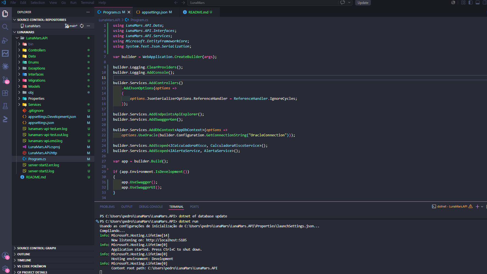

### Swagger com endpoints da API

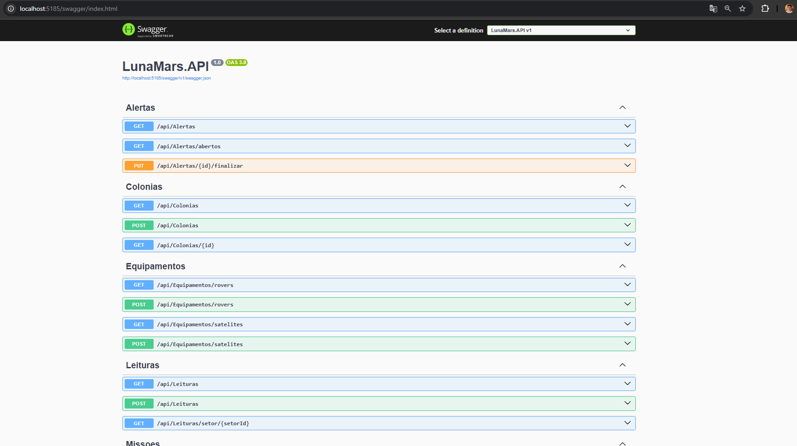

### Consulta de alertas pelo Swagger

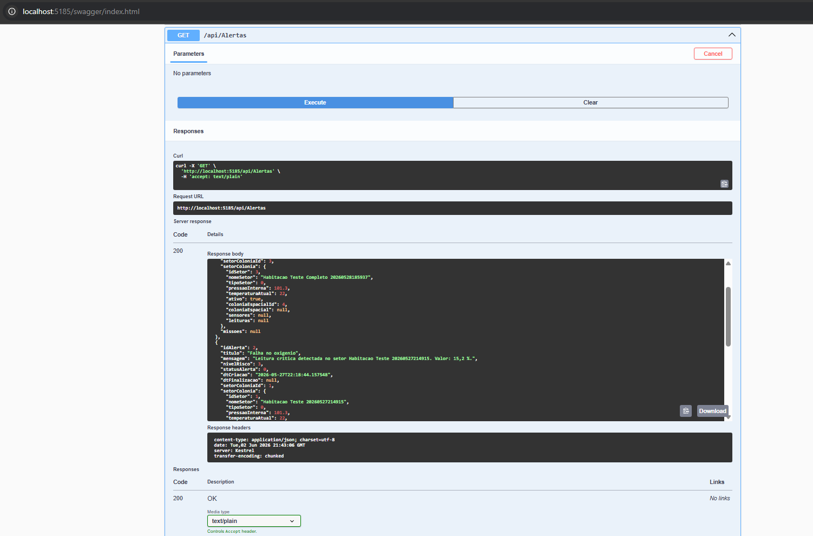

### Cadastro de colonia pelo Postman

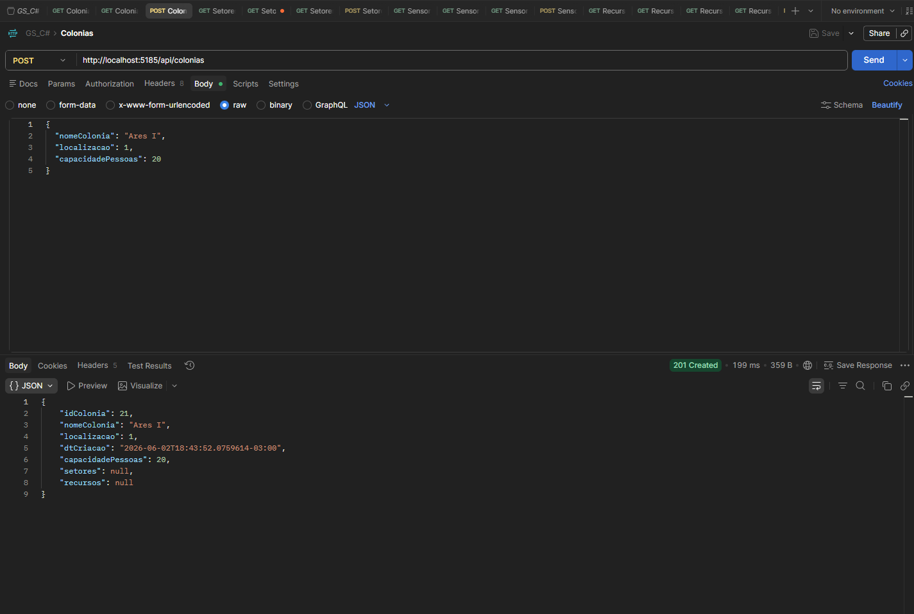

### Conclusao de missao pelo Postman

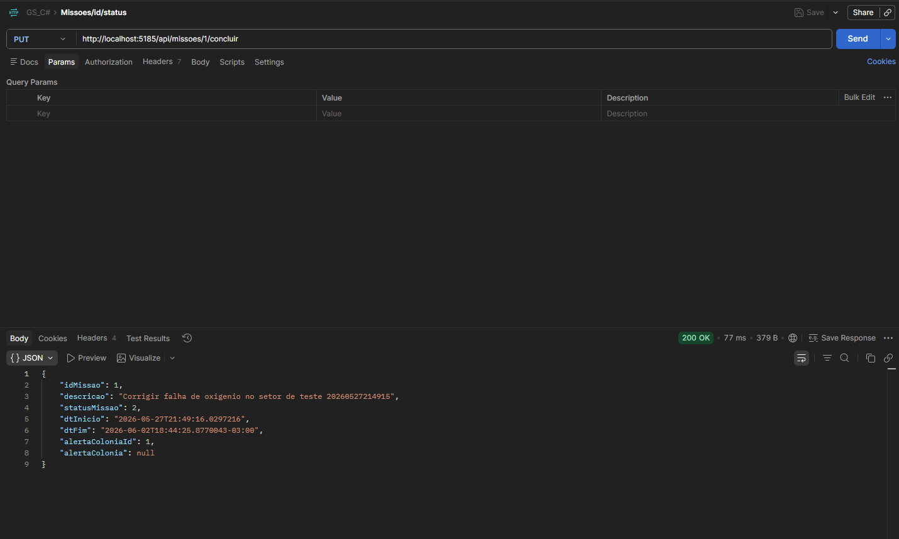

### Remocao de colonia pelo Postman

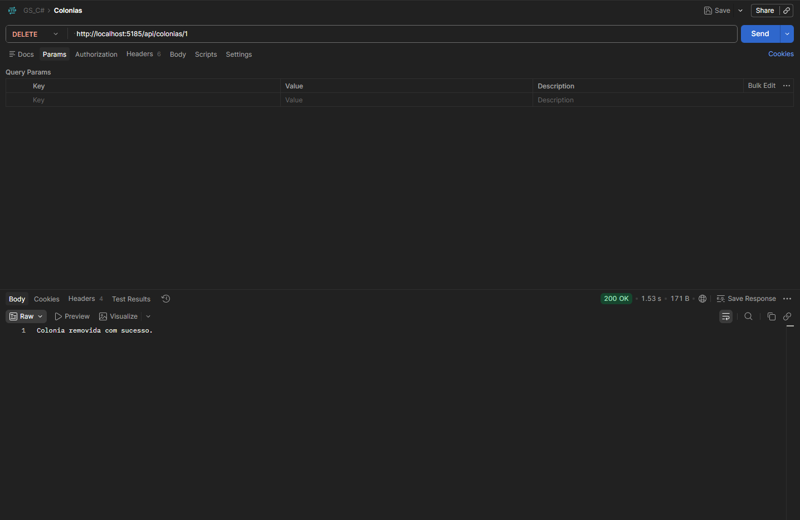

### Tratamento de erro em DELETE com ID inexistente

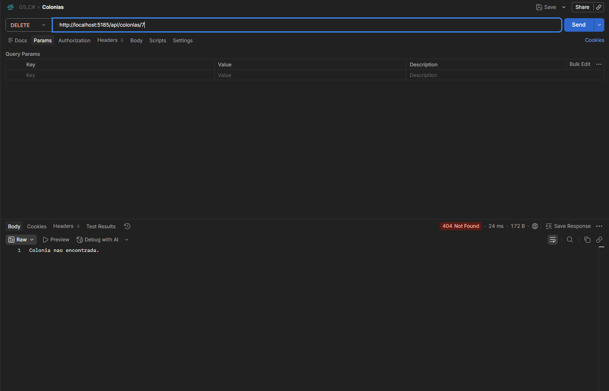

### README com endpoints documentados

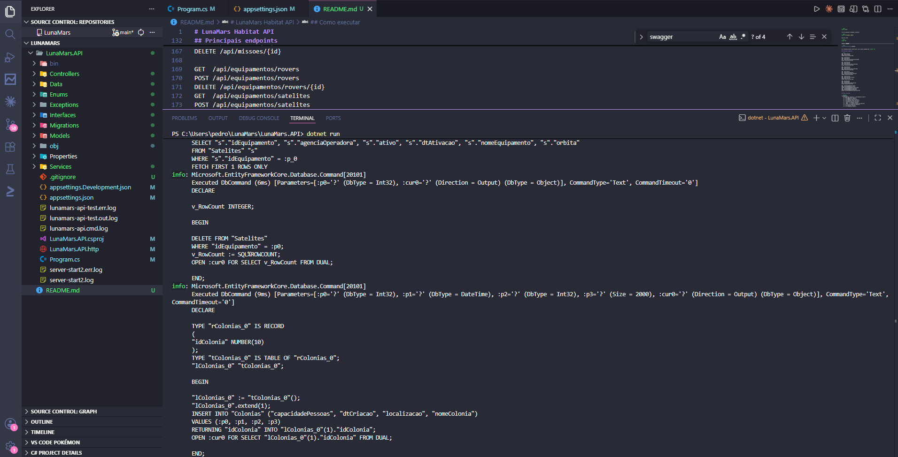

### Tratamento de erro para leitura negativa

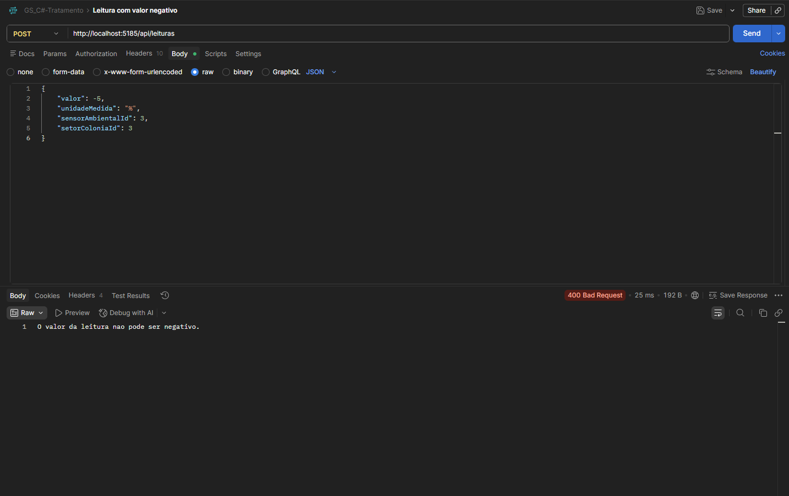

### Tratamento de erro para temperatura invalida

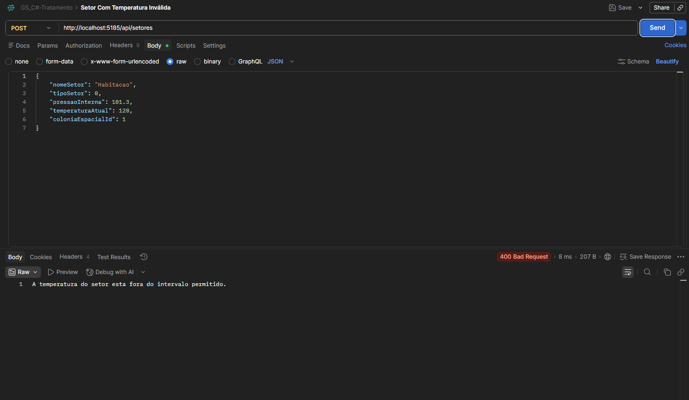
